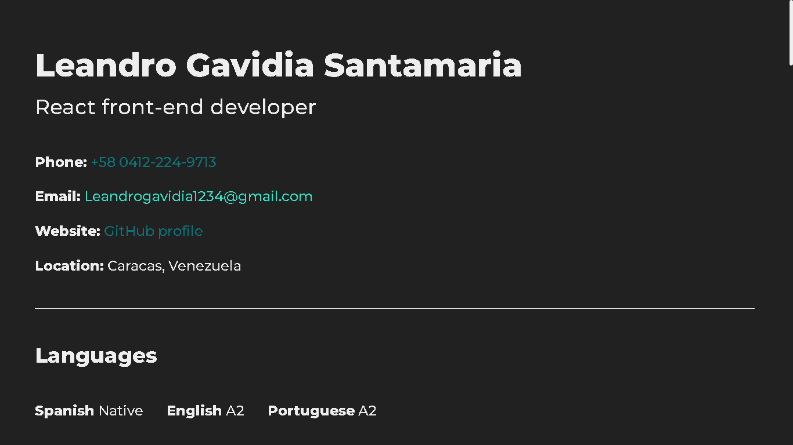

# react-eth-challenge

## Mi solución para los siguientes retos:

### Retos

1. [Crear los componentes del proyecto](https://github.com/gndx/react-eth-challenge/issues/1)
2. [Añadir estilos](https://github.com/gndx/react-eth-challenge/issues/2)
3. [Crear función getData.js](https://github.com/gndx/react-eth-challenge/issues/3)
4. [Integrar API](https://github.com/gndx/react-eth-challenge/issues/4)
5. [Personalizar API](https://github.com/gndx/react-eth-challenge/issues/5)
6. [Documentar](https://github.com/gndx/react-eth-challenge/issues/6)
7. [Deploy](https://github.com/gndx/react-eth-challenge/issues/7)

---



---

### Principales cambios:

  - Stylus -> Sass
  - Nueva sección "About my projects"
  - CV de una sola columna
  - Sin imagen

<br/>

[**Deploy**](https://leandrogavidia.github.io/react-eth-challenge/)

---

### Instalación

```
npm install
```

### Ejecución

```
npm run start
```

### Server

```
npm run server
```

### Compilar

```
npm run build
```

### Pruebas Unitarias

```
npm run test
```

### ESlint

```
npm run lint
```

### Licencia

frontend se lanza bajo la licencia [MIT](https://opensource.org/licenses/MIT).
